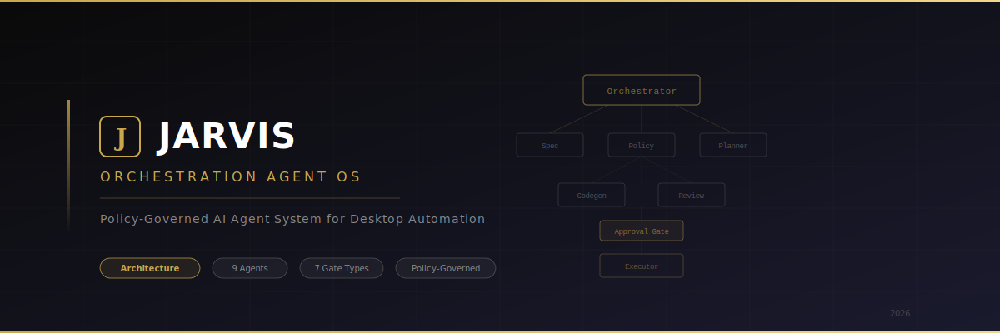

**AI가 데스크톱을 직접 조작하되, 정책과 승인으로 신뢰를 만드는 시스템**


---

## JARVIS OS란

JARVIS Orchestration Agent OS는 **AI 에이전트가 사용자의 컴퓨터를 직접 조작**하여 작업을 수행하는 시스템입니다.

단순한 챗봇이 아닙니다. 파일을 만들고, 앱을 실행하고, 브라우저를 조작하고, 코드를 구현합니다.
그리고 이 모든 행위는 **정책 판정 → 사용자 승인 → 감사 추적**이라는 3중 제어를 거칩니다.

> AI에게 컴퓨터를 맡기는 것은 위험합니다.
> 그래서 이 시스템은 **"신뢰를 설계하는 것"** 자체가 핵심 기능입니다.

---

## 핵심 아키텍처

```
사용자 (Text / Voice)
        │
        ▼
┌─────────────────────────────────────────────────┐
│                 Orchestrator                     │
│           (Control Plane · 코드 작성 금지)        │
│                                                 │
│    복잡도 평가 → 전략 선택 → 환경 구성 → 팀 배치    │
└────────────────────┬────────────────────────────┘
                     │
        ┌────────────┼────────────┐
        ▼            ▼            ▼
   ┌─────────┐ ┌──────────┐ ┌─────────┐
   │  Spec   │ │  Policy  │ │ Planner │
   │  Agent  │ │  & Risk  │ │  Agent  │
   └─────────┘ └──────────┘ └────┬────┘
                                  │
                    ┌─────────────┼──────────┐
                    ▼             ▼          ▼
              ┌──────────┐ ┌──────────┐ ┌──────────┐
              │ Codegen  │ │  Review  │ │ Test &   │
              │  Agent   │ │  Agent   │ │  Build   │
              └──────────┘ └──────────┘ └──────────┘
                                  │
                    ┌─────────────┼──────────┐
                    ▼             ▼          ▼
            ┌────────────┐  ┌─────────┐ ┌──────────┐
            │  Executor  │  │Recovery │ │  Audit   │
            │ (OS 전담)   │  │& Rollback│ │   Log   │
            └────────────┘  └─────────┘ └──────────┘
```

---

## 이 아키텍처의 이유

AI가 OS를 직접 조작한다는 것은 **모든 것이 사고가 될 수 있다**는 뜻입니다.

이 시스템은 그 위험을 5가지 원칙으로 통제합니다.


| 원칙                        | 설명                                            |
| ------------------------- | --------------------------------------------- |
| **Single Execution Path** | OS 조작은 오직 Executor Agent 하나만 수행. 다른 에이전트는 불가. |
| **One-Time Capability**   | 영구 권한 없음. 매 작업마다 발급받고, 사용 후 소멸.               |
| **Mandatory Gate**        | 위험 작업은 반드시 사용자가 승인해야 실행. 예외 없음.               |
| **Policy-First**          | 계약서와 금지 목록이 모든 판단보다 우선. AI의 판단보다 정책이 위.       |
| **Immutable Audit**       | 모든 행위를 삭제 불가 로그로 기록. 해시 체인으로 위변조 방지.          |


---

## 에이전트 팀

9개의 전문 에이전트가 역할을 분담합니다. 단일 에이전트에게 전권을 주지 않습니다.


| Agent             | Role                                          | Model  |
| ----------------- | --------------------------------------------- | ------ |
| **Orchestrator**  | 전체 흐름 제어, 에이전트 배치, Gate 설계. 코드는 작성하지 않음       | —      |
| **Intent & Spec** | 자연어 요청을 명세(SPEC)와 수용 기준으로 변환                  | Haiku  |
| **Policy & Risk** | 계약서 위배 판단, 위험도 점수(0~100) 산출, Capability 발급    | Haiku  |
| **Planner**       | 단계별 실행 계획(WBS) 작성, 최소 권한/최소 변경 원칙             | Sonnet |
| **Codegen**       | 코드 작성(패치 단위), 시크릿 하드코딩 금지                     | Opus   |
| **Review**        | 보안/품질 정적 분석. secrets, injection, RCE, 라이선스 검사 | Sonnet |
| **Test & Build**  | 로컬 빌드/테스트 실행, 실패 시 최소 수정 패치 피드백               | Haiku  |
| **Executor**      | 승인된 Action만 OS에서 수행. Enforcement Hook 필수 통과   | —      |
| **Recovery**      | 오류 시 즉시 중단 및 원상복구, 재발 방지 정책 제안                | —      |


Orchestrator는 프로젝트 복잡도를 평가하여 **에이전트 팀이 필요한지, 단일 실행이 충분한지** 판단합니다.
복잡도가 낮으면 팀을 호출하지 않아 토큰 비용을 절약합니다.

---

## 승인 게이트 시스템

위험한 작업은 AI가 임의로 실행할 수 없습니다. 7종의 승인 게이트가 사용자의 동의를 강제합니다.

```
┌─────────────────────────────────────────────────────────┐
│                    APPROVAL GATES                        │
│                                                         │
│  Main Flow                                              │
│  ─────────                                              │
│  Gate #1   Plan & Scope       계획/범위 승인             │
│  Gate #1A  Tool & Install     패키지/네트워크 승인        │
│  Gate #2   Apply Changes      코드 변경 적용 승인        │
│  Gate #3   Run & Deploy       실행/배포 승인 (선택)      │
│                                                         │
│  Security Gates                                         │
│  ───────────────                                        │
│  Web Precheck                 URL 신뢰도/피싱 탐지       │
│  Download Approve             다운로드 격리/스캔 후 승인  │
│  Destructive                  파괴적 작업(삭제 등) 승인   │
│                                                         │
│  Auto-Generated                                         │
│  ──────────────                                         │
│  Safety Hold                  이상 징후 자동 정지         │
│  Policy Update                정책 업데이트 승인          │
│                                                         │
│  Common Actions:                                        │
│  [Approve once] [Approve always] [Reject] [Edit scope]  │
└─────────────────────────────────────────────────────────┘
```

모든 게이트에서 사용자는 **범위를 축소**할 수 있습니다.
`/project/`** 쓰기 허용을 `/project/src/**`로 줄이는 식입니다.

---

## 보안 계층

### 정책 계층 (3단계 방어)

```
Layer 1 ─ Policy Source     계약서 / 금지 목록 / 허용 목록 로드
Layer 2 ─ Decision          요청 분석 → ALLOW / DENY / APPROVAL_REQUIRED
Layer 3 ─ Enforcement       OS 조작 직전 강제 차단
```

### 위험도 점수


| Score  | Level  | Action      |
| ------ | ------ | ----------- |
| 0–30   | LOW    | 자동 실행       |
| 31–70  | MEDIUM | 사용자 승인 필요   |
| 71–100 | HIGH   | 계약서 위반으로 차단 |


### 고위험 자동 차단

금융, 결제, OS 계정 관리, 인증서 관리, 클라우드 IAM은 **AI 자동화가 원천 차단**됩니다.
사용자 수동 입력만 허용합니다.

### 다운로드 파이프라인 (5단계)

```
BROWSER_DOWNLOAD → FILE_QUARANTINE → FILE_SCAN → GATE_APPROVE → FILE_RELEASE
     (샌드박스)        (격리 태그)      (해시/서명)    (사용자 승인)     (반출)
```

### 프롬프트 인젝션 방어 (3단계)

```
Input Sanitization   →   외부 데이터 정제, 숨김 텍스트 제거
Context Isolation     →   외부 데이터를 "untrusted" 태그로 분리
Output Validation     →   AI 응답의 비정상 행동 패턴 차단
```

### Threat Model (6대 공격 벡터)

```
  1. Prompt Injection      사용자 입력 / 파일 내용 / 환경 변수를 통한 LLM 명령 주입
  2. Privilege Escalation   Capability Token 위조, 만료 토큰 재사용, Trust Mode 우회
  3. Data Exfiltration      파일 외부 전송, 환경 변수 노출, 스크린 캡처 유출
  4. Denial of Service      무한 루프 유도, 대량 파일 생성, API Rate Limit 고갈
  5. Integrity Tampering    시스템 파일 변조, 로그 삭제, Git 히스토리 조작
  6. Supply Chain Attack    악성 패키지 설치, 의존성 혼동, 플러그인 백도어
```

---

## 자격 증명 보안

AI는 비밀번호를 절대 보거나 저장하지 않습니다.

```
사용자 자격 증명 → Credential Vault (DPAPI / Keychain)
                        │
                   세션 토큰만 AI에게 전달
                        │
                   작업 종료 시 세션 제거
```

- Windows: Credential Manager / DPAPI
- macOS: Keychain
- 비밀번호 입력: Secure Input Overlay (사용자 직접 입력, AI 화면 비표시)
- 로그에 저장 금지: 비밀번호, 토큰 원문, 쿠키 원문

---

## 신뢰 모드

사용자가 AI의 자율성 수준을 직접 제어합니다.


| Mode          | Description                          | Auto Execution |
| ------------- | ------------------------------------ | -------------- |
| **Observe**   | 분석/설명만. OS 액션 금지.                    | None           |
| **Suggest**   | 모든 작업에 Gate 필수. 자동 실행 없음.            | None           |
| **Semi-Auto** | LOW risk만 자동 실행. 나머지 Gate.           | LOW only       |
| **Auto**      | Owner 전용. 강한 제한 + TTL 필수 + scope 축소. | Scoped         |


Auto 모드에도 Emergency Stop은 **어디서든 1클릭**으로 작동합니다.

### 점진적 신뢰 승급 (Progressive Trust Escalation)

시스템은 사용 이력을 기반으로 Trust Mode 업그레이드를 자동 제안합니다.

```
Observe → (20회 연속 성공) → Suggest → (50회 연속 성공) → Semi-Auto → (100회) → Auto
```

- 작업 유형별 세분화된 신뢰 레벨 (파일 조작은 Auto, 시스템 작업은 Suggest 등)
- 보안 사고 감지 시 Observe로 즉시 강등
- 사용자가 언제든 수동으로 조정 가능

---

## 상태 머신

XState v5 기반의 전체 상태 머신이 모든 실행 흐름을 제어합니다.

```
 INPUT_RECEIVED
      │
 SPEC_DRAFTED
      │
 POLICY_DECIDED ─── DENY ──→ BLOCKED
      │
 GATE_APPROVAL ─── Reject ──→ BLOCKED
      │ Approve       ↑ Timeout (5min)
 PLAN_READY
      │
 PLAN_REVIEW ─── Needs Revision ──→ PLAN_READY (loop)
      │
 CODE_WRITTEN
      │
 CODE_REVIEW ─── Needs Revision ──→ CODE_WRITTEN (loop)
      │
 TEST_EXECUTED ─── Fail ──→ CODE_WRITTEN (loop)
      │
 EXECUTION_GATE ─── Auto Mode ──→ EXECUTING
      │ Needs Approval
 EXECUTION_APPROVAL
      │ Approve
 EXECUTING ─── Pause ──→ PAUSED ─── Resume ──→ EXECUTING
      │          Cancel ──→ ROLLBACK
 VERIFYING
      │
 ┌────┴────┐
 │         │
DONE    ROLLBACK ──→ ROLLED_BACK
                Error ──→ CRITICAL_ERROR
```

### 상태 영속화

```
  시점                저장 위치           내용
  ─────────────────────────────────────────────────
  상태 전이 시        SQLite (로컬)       전체 context 스냅샷
  Gate 응답 시        SQLite + 메모리     gateResponses 업데이트
  세션 종료 시        JSON 파일           전체 Run 상태 직렬화
  앱 재시작 시        SQLite → 메모리     마지막 스냅샷 복원
```

---

## 자기 교정 시스템

에이전트가 **"기술적으로 성공했지만 사용자가 원한 게 아닌"** 시맨틱 에러를 감지하고 스스로 교정합니다.

### 교정 에스컬레이션

```
  거부 1회 → 재시도 + "이런 뜻인가요?" 명확화 질문
  거부 2회 → 접근 방식 전체 변경 + 대안 3가지 제시
  거부 3회 → 에스컬레이션 → 구조화된 폼으로 구체적 지시 요청
  거부 4회+ → 해당 작업 유형에 "항상 확인" 모드 전환
```

### 에이전트 성적표 (Performance Scoring)

```
  에이전트별 적중률을 실시간 추적:
  - 90-100%  우수 → 현재 전략 유지
  - 70-79%   주의 → 프롬프트 전략 변경
  - 60-69%   경고 → 모델 업그레이드 (Haiku→Sonnet→Opus)
  - < 60%    위험 → 에이전트 비활성화 + 대체 전략
```

### Mistake Pattern DB

실수 패턴을 학습하여 같은 실수를 반복하지 않습니다.

```
  패턴 저장 → 다음 실행 시 프롬프트에 교정 규칙 자동 주입
  예: "정리해줘" → "삭제 후 재작성" (잘못됨) → "in-place 리팩터링" (올바름)
  → 다음번 "정리" 요청 시 자동으로 올바른 해석 적용
```

### 사용자 만족도 시그널

명시적 피드백 없이도 행동 패턴으로 만족도를 추론합니다.

```
  만족: 결과 즉시 사용, 수정 없이 저장, 다음 작업 진행
  불만: 70%+ 수정, Undo 요청, 동일 명령 재입력, 세션 종료
```

---

## 지능형 기능

### Semantic Memory (장기 학습 기억)

세션 간 사용자 의도, 코딩 스타일, 프로젝트 맥락을 학습합니다.

```
  메모리 유형          예시                              저장 기간
  ─────────────────────────────────────────────────────────────
  User Preference     "TypeScript + Vitest 선호"        영구
  Coding Style        "import 순서: react → lib → local" 프로젝트
  Domain Knowledge    "이 API는 v2 엔드포인트 사용"      프로젝트
  Error Memory        "이 패턴은 항상 실패함"             90일
  Context Memory      "어제 auth 모듈 작업 중이었음"      7일
```

- 벡터 DB 기반 유사 경험 검색
- 모든 데이터 로컬 저장 (외부 전송 없음)
- 사용자가 전체 메모리 열람/삭제/초기화 가능

### Intent Disambiguation (의도 분기 선택)

모호한 명령을 여러 해석으로 분기하여 카드 UI로 제시합니다.

```
  "이 코드 정리해줘" →

  ┌──────────────┐  ┌──────────────┐  ┌──────────────┐
  │ 코드 포맷팅   │  │ 리팩터링      │  │ dead code    │
  │ Risk: LOW    │  │ Risk: MEDIUM │  │ 삭제          │
  │ 5초          │  │ 30초         │  │ Risk: LOW    │
  │ 1개 파일     │  │ 3개 파일     │  │ 10초         │
  └──────────────┘  └──────────────┘  └──────────────┘
```

선택 기록은 Semantic Memory에 반영되어 점점 정확해집니다.

### Smart Context Collector (자동 맥락 수집)

사용자가 명시하지 않아도 주변 맥락을 자동 수집하여 에이전트에게 제공합니다.

```
  수집 소스: IDE 열린 파일, Git status/diff, 터미널 히스토리,
            실행 중인 프로세스, 현재 브랜치, 에러 로그
  전략: 관련성 기반 필터링 → 토큰 예산에 맞춰 압축 → 선택적 주입
```

### Multi-Agent Debate (에이전트 토론)

복잡한 결정에서 에이전트들이 찬반 토론 후 합의합니다.

```
  Round 1: Planner → Plan A, Plan B 제안
  Round 2: Review + Policy → 각 Plan 약점 지적
  Round 3: Planner → 반론 반영 수정안
  합의: 참여 에이전트 점수 가중 평균 → 최종 권고안
```

- 최대 3라운드, 토론 총 토큰 한도 15,000
- Risk Score 50~70 경계 구간에서 자동 트리거

### Execution Cost Estimator (비용 예측)

실행 전에 예상 비용/시간/위험을 요약 카드로 표시합니다.

```
  ┌──────────────┐  ┌──────────────┐  ┌──────────────┐
  │ 예상 시간     │  │ 예상 비용     │  │ 위험도       │
  │  2분 30초    │  │   $0.12     │  │  ████░░ 62  │
  └──────────────┘  └──────────────┘  └──────────────┘
  영향 범위: 수정 23개 파일, 생성 1개, 패키지 +3
```

### Action Replay & Macro (매크로 녹화)

승인된 실행 시퀀스를 재사용 가능한 매크로로 저장합니다.

```
  $ jarvis macro run react-component --componentName=Modal
  → mkdir, create .tsx, create .test.tsx, create .css, update index.ts
  → 변수 치환 지원, 팀 내 공유 가능
```

---

## 런타임 최적화

### 토큰 예산 관리

```
  에이전트          모델         평균 토큰          비용 비중
  ──────────────────────────────────────────────────────
  Orchestrator     Sonnet       ~500              낮음
  Intent & Spec    Sonnet       ~2,300            중간
  Policy & Risk    Haiku        ~1,100            낮음
  Planner          Sonnet       ~3,500            높음
  Codegen          Opus         ~5,000            최고
  Review           Sonnet       ~2,500            중간
  Executor         규칙 기반     0                 없음
```

### 5가지 절감 전략

```
  전략                    절감 예상
  ─────────────────────────────────────
  1. Prompt Caching       ~30% input
  2. 조건부 에이전트 스킵   ~40% 전체
  3. 점진적 컨텍스트       ~20% input
  4. 모델 다운그레이드     ~60% 비용
  5. 결과 캐싱            ~50% 반복
```

### 상호 감시 (Mutual Watchdog)

```
  Review → Codegen 감시 (코드 품질, 보안)
  Policy → Planner 감시 (정책 준수)
  Test & Build → Executor 감시 (실행 결과 정합성)
  Recovery → 전체 에이전트 감시 (에러 패턴, 무한 루프)
  Orchestrator → 전체 파이프라인 (타임아웃, 교착 상태)
```

### 행동 패턴 캐시

승인/거부 패턴을 학습하여 Gate 자동 승인을 제안합니다.

```
  "npm install lodash" → 15회 연속 승인 (신뢰도 95%)
  → [자동 승인] [이번만 승인] [직접 검토] [규칙으로 저장]
```

안전 장치: HIGH risk 자동 적용 불가, 30일 미사용 만료, 연속 10회 제한

---

## UI 레이아웃

3패널 + 상단 상태바 구조입니다. 사용자는 대화하면서 타임라인과 승인 패널로 통제합니다.

```
┌─────────────────────────────────────────────────────────────────┐
│ MODE: Semi-auto  RISK: 42(MED)  STEP: Review  TTL: 08:12 [STOP]│
├───────────────┬───────────────────────────┬─────────────────────┤
│               │                           │                     │
│  Chat/Voice   │  Plan & Execution         │  Safety Panel       │
│               │  Timeline                 │                     │
│  user: ...    │  1 SPEC ✅                │  [Approval]         │
│  jarvis: ...  │  2 POLICY ✅              │  Gate #2            │
│               │  3 PLAN ✅                │  - files: 6         │
│               │  4 CODE ✅                │  - diff view        │
│               │  5 REVIEW ⏸️              │                     │
│               │  6 TEST ⏳                │  [Approve once]     │
│               │                           │  [Always for scope] │
│               │                           │  [Reject]           │
├───────────────┴───────────────────────────┴─────────────────────┤
│ Evidence: screenshots │ logs │ download hashes │ scan results    │
└─────────────────────────────────────────────────────────────────┘
```

디자인 컨셉: **Glass + Minimal HUD** — 평상시 차분하고, 위험할 때만 강조.

---

## 원격 제어 애니메이션

AI가 OS를 조작할 때 마우스 커서가 실제로 움직입니다.

```
실제 실행 속도:  ~0.1초 (기계 속도)
시각 표현 속도:  ~0.4–0.8초 (사람 인지 속도)
```

- **Bezier curve 가속**: 시작에 빠르게, 도착점 근처에서 감속
- **Target Highlight**: 다음 클릭 대상을 미리 하이라이트
- **위험 작업은 느리게**: DESTRUCTIVE, DOWNLOAD, LOGIN 태그가 붙은 액션은 강제 슬로우모션
- **Compressed Replay**: 놓친 부분을 x2, x5 속도로 재생 가능

---

## 실시간 협업 모드

여러 사용자가 동일 Run을 실시간으로 관찰하고 공동 승인할 수 있습니다.

```
  역할          명령 실행    Gate 승인    Plan 수정    관찰    채팅
  ──────────────────────────────────────────────────────────────────
  Owner         ✅           ✅           ✅           ✅     ✅
  Co-Owner      ✅           ✅           ✅           ✅     ✅
  Reviewer      ❌           ✅           ❌           ✅     ✅
  Observer      ❌           ❌           ❌           ✅     ✅
```

- **Multi-Signature Gate**: 위험 작업에 복수 승인 필요 (2-of-3 등)
- **실시간 동기화**: 상태 전이, Gate 발동, 채팅 메시지 WebSocket 전파
- **협업 채팅**: Run 진행 중 사용자 간 실시간 대화

---

## 프로젝트 구조

### 현재 (설계 단계)

```
.
├── .claude/
│   └── workflow.md          # 전체 시스템 설계 문서 (7,000+ lines)
├── assets/
│   └── banner.svg           # 프로젝트 배너 이미지
└── README.md
```

### 구현 목표 (Monorepo)

```
jarvis-os/
├── packages/
│   ├── core/                    # 공유 커널
│   │   ├── state-machine/       # XState 기반 RunState 엔진
│   │   ├── policy-engine/       # PolicyDecision 평가기
│   │   ├── action-api/          # Action 스키마 & 직렬화
│   │   ├── capability-token/    # 토큰 발급 / 검증
│   │   ├── event-bus/           # 에이전트 간 통신 버스
│   │   └── types/               # 공용 TypeScript 타입
│   │
│   ├── agents/                  # 9개 에이전트 패키지
│   │   ├── orchestrator/
│   │   ├── intent-spec/
│   │   ├── policy-risk/
│   │   ├── planner/
│   │   ├── codegen/
│   │   ├── review/
│   │   ├── test-build/
│   │   ├── executor/
│   │   └── recovery/
│   │
│   ├── ui/                      # React 프론트엔드
│   ├── cli/                     # 터미널 인터페이스 (MVP)
│   └── shared/                  # 유틸리티 (logger, config, test-utils)
│
├── plugins/                     # 커스텀 에이전트 플러그인
├── infra/                       # Docker, 스크립트
├── docs/                        # 프로젝트 문서
├── turbo.json                   # Turborepo 설정
├── pnpm-workspace.yaml
└── tsconfig.base.json
```

### workflow.md 설계 문서 (14개 섹션)


| Section               | Content                                              |
| --------------------- | ---------------------------------------------------- |
| Agent Definitions     | 9개 에이전트의 역할, 입출력, 책임, 금지사항                         |
| Policy Schema         | PolicyDecision JSON 스키마, 계약서 템플릿                     |
| Gate Specifications   | 7종 Gate의 UI 와이어프레임, payload, 버튼                      |
| Action API            | Executor 액션 타입, Enforcement Hook, Trace 포맷           |
| State Model           | TypeScript 타입 정의, 이벤트 스트림, RunState                  |
| UI Components         | React 컴포넌트 트리, 3패널 레이아웃, Design Tokens               |
| Security Layers       | FS/네트워크/Credential/Supply Chain/DLP 정책               |
| Remote Control        | 커서 애니메이션, 속도 규칙, CursorFrame 인터페이스                   |
| Improvements (A~I)    | 37개 보완 항목 (아키텍처, 보안, 거버넌스, Executor, UI, 음성, 테스트 등) |
| Implementation (J)    | Monorepo 구조, State Machine, CLI MVP, E2E 시나리오, 우선순위  |
| Runtime Intel (K)     | Token Budget, Watchdog, Pattern Cache, Workspace Profile |
| Developer Exp (L)     | Agent SDK, Policy DSL, DevTools, Threat Model, Versioning |
| Self-Correction (M)   | Correction Loop, Performance Scoring, Mistake DB, 만족도   |
| Advanced Features (N) | Semantic Memory, Disambiguation, Macro, Debate, Collaboration |


---

## 구현 로드맵

### Phase 0 — Foundation

> Monorepo 셋업, 공유 타입, 빌드 파이프라인

- pnpm + Turborepo 초기화
- `packages/core/types` 정의
- tsconfig, Vitest, Biome 설정
- CI (GitHub Actions) 기본

### Phase 1 — Core Engine

> 핵심 엔진 3종 구현

- State Machine (XState v5)
- Policy Engine
- Action API + Capability Token
- Event Bus + SQLite 상태 영속화

### Phase 2 — Agent Pipeline

> 9개 에이전트 기본 구현 (stub → real)

- Orchestrator, Intent & Spec, Policy & Risk (P0)
- Planner, Executor (P0)
- Recovery, Review (P1)
- Codegen, Test & Build (P2)

### Phase 3 — CLI MVP

> React UI 이전에 터미널 인터페이스로 파이프라인 검증

```
jarvis run <instruction>       # 자연어 명령 실행
jarvis plan <instruction>      # Plan만 생성
jarvis approve <run-id>        # Gate 승인
jarvis status [run-id]         # 상태 확인
jarvis policy test <action>    # 정책 시뮬레이션
```

### Phase 4 — React UI

> 4-Panel 레이아웃, 실시간 상태, Gate UI

- Chat/Voice 패널
- Plan & Execution Timeline
- Safety & Approval 패널
- Evidence 패널
- Glass + Minimal HUD 디자인

### Phase 5 — Polish & Harden

> 보안 강화, 지능형 기능, 협업

- Self-Correction 시스템 (M)
- Semantic Memory + Disambiguation (N-1, N-2)
- Agent Debate Protocol (N-6)
- Real-time Collaboration (N-8)
- Macro System + Cost Estimator (N-3, N-4)
- Remote Control Animation
- Plugin Architecture

### MVP 검증 시나리오 (First Vertical Slice)

```
  $ jarvis run "hello.txt 만들어줘"

  ✓ Intent 분석 완료 (1.2s)
  ✓ 정책 평가: LOW risk (0.3s)
  ✓ 실행 계획 생성 (0.8s)
  ✓ hello.txt 생성 완료 (0.1s)

  결과: ~/hello.txt 파일이 생성되었습니다.
  총 소요 시간: 2.4s
```

10가지 E2E 시나리오로 MVP 완성을 검증합니다:

| #  | 시나리오                         | 검증 포인트           |
| -- | ------------------------------ | ------------------- |
| 1  | "hello.txt 파일 만들어줘"        | 최소 파이프라인 E2E    |
| 2  | ".js를 .ts로 변환해줘"           | 다중 파일 조작         |
| 3  | "npm install lodash"           | 패키지 설치 Gate      |
| 4  | "~/Documents 정리해줘"          | 위험 경로 감지         |
| 5  | "Python 스크립트 실행해줘"        | 코드 실행 Gate       |
| 6  | "시스템 설정 변경해줘"             | BLOCKED 정책        |
| 7  | 중간에 취소                      | Pause → Rollback    |
| 8  | 동일 명령 반복                   | Pattern Cache 학습   |
| 9  | 네트워크 끊김 상태                | Offline-First       |
| 10 | 앱 재시작 후 복원                 | State Resume        |

---

## 핵심 설계 결정


| Decision                     | Rationale                                                               |
| ---------------------------- | ----------------------------------------------------------------------- |
| Orchestrator는 코드를 작성하지 않는다 | 제어 주체와 실행 주체를 분리하여 안전성 확보. Orchestrator는 Environment Composer.          |
| Capability는 일회성이다            | 영구 권한을 주면 100% 사고. 매번 발급-소비-폐기.                                        |
| 에이전트마다 모델이 다르다               | 토큰 최적화. Spec/Policy는 Haiku, Codegen은 Opus, Planner/Review는 Sonnet.      |
| 에이전트가 서로를 감시한다              | Mutual Watchdog 패턴. 단일 에이전트의 판단을 맹신하지 않음.                                |
| 실수를 학습하고 자기 교정한다            | Mistake Pattern DB + Adaptive Prompt. 같은 실수 반복 방지.                       |
| CLI MVP를 UI보다 먼저 구현           | 파이프라인 검증 속도 우선. React UI는 Phase 4.                                       |
| 실행 전 반드시 시뮬레이션               | 실제 실행의 영향을 예측할 수 없으므로 가상 환경에서 먼저 검증.                                     |
| 정책 변경도 Gate를 거친다             | Self-learning이 잘못된 정책을 만들면 시스템 오염. proposed → 승인 → version bump.         |
| 모든 데이터는 로컬에 저장               | Semantic Memory, Pattern Cache, Audit Log 모두 로컬. 프라이버시 보장.                |


---

## 기술 스택


| Layer              | Technology                                         |
| ------------------ | -------------------------------------------------- |
| AI Models          | Claude API (Opus, Sonnet, Haiku)                   |
| Agent Framework    | Claude Agent SDK / CLI                             |
| State Machine      | XState v5                                          |
| OS Automation      | Action API (추상화 계층)                                |
| Browser Automation | Playwright (격리 프로필)                                |
| Credential Storage | Windows DPAPI / macOS Keychain                     |
| Frontend           | React + TypeScript                                 |
| CLI                | Commander.js + Inquirer.js + chalk                 |
| Styling            | Tailwind CSS + CSS Variables (Design Tokens)       |
| Animation          | Framer Motion                                      |
| State Management   | Zustand + Event-driven Reducer (RunState)          |
| Database           | SQLite (WAL mode) + 로컬 벡터 DB                     |
| Monorepo           | pnpm + Turborepo                                   |
| Build              | tsup (ESM/CJS)                                     |
| Test               | Vitest                                             |
| Lint/Format        | Biome                                              |
| Audit Log          | Append-only + Hash Chain                           |


---

## 설계 문서 규모

```
  총 68개 보완 항목 (14개 카테고리)

  A. 아키텍처    (5개)    H. 데이터      (3개)
  B. 보안        (6개)    I. 확장성      (4개)
  C. 거버넌스    (5개)    J. 구현 기반   (6개)
  D. Executor    (5개)    K. 런타임 지능 (5개)
  E. UI/UX      (6개)    L. 개발자 경험 (5개)
  F. 음성/대화   (3개)    M. 자기 교정   (5개)
  G. 테스트      (4개)    N. 고급 기능   (8개)
```

전체 설계 문서는 `.claude/workflow.md` (7,000+ lines)에서 확인할 수 있습니다.

---

## 라이선스

이 프로젝트는 현재 아키텍처 설계 단계입니다.
첫 코드 릴리스 전에 라이선스가 결정됩니다.

---

Designed and documented by **Daniel Kang** · 2026
