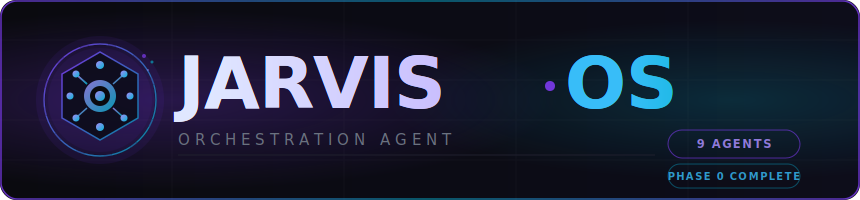

<div align="center">

<!-- 프로젝트 로고 및 배너 (다크/라이트 모드 자동 전환) -->

<picture>
  <source media="(prefers-color-scheme: dark)"  srcset="assets/banner-dark.svg">
  <source media="(prefers-color-scheme: light)" srcset="assets/banner-light.svg">
  
</picture>

<br/>
<br/>

<p>
  <strong>AI 에이전트가 데스크톱을 직접 조작하는 자율 운영체제</strong><br/>
  <sub>9개 전문 에이전트 · 정책 기반 게이트 · 불변 감사 로그 · 일회성 Capability Token</sub>
</p>

<br/>

<!-- 배지 -->

<p>
  
   
  
   
  
   
  
</p>

<p>
  
   
  
   
  
   
  
</p>

</div>

---

<br/>

## 개요

**JARVIS Orchestration OS**는 AI 에이전트가 사용자 대신 데스크톱(Windows/macOS)과 모바일 디바이스를 안전하게 자동화하는 **자율 에이전트 오케스트레이션 시스템**입니다.

단순한 스크립트 자동화가 아닙니다. 9개의 전문 AI 에이전트가 서로 역할을 분리한 채 협력하고, 모든 위험한 작업마다 사용자 승인 게이트를 통과해야 하며, 단 하나의 액션도 감사 로그에 빠짐없이 기록됩니다.

```
사용자 자연어 요청
  │
  ▼
┌─────────────────────────────────────────────────────────────────────┐
│  SPEC_ANALYSIS → POLICY_CHECK → [Gate L1] → PLANNING               │
│  → CODE_GENERATION → CODE_REVIEW → [Gate L2] → TESTING             │
│  → [Gate L3] → DEPLOYMENT → COMPLETED                              │
└─────────────────────────────────────────────────────────────────────┘
  │                   │                    │
  ▼                   ▼                    ▼
불변 감사 로그    Capability Token    사용자 승인 게이트
(SQLite 해시체인)  (1회용 권한 토큰)   (7+ 체크포인트)
```

<br/>

---

## 핵심 보안 메커니즘

JARVIS OS는 **3중 방어 아키텍처**로 AI의 자율 행동을 제어합니다.

### 1. Capability Token — 일회성 권한

모든 OS 조작에는 반드시 **일회성 Capability Token**이 필요합니다. 토큰은 사용 즉시 무효화되며, 범위(scope), 유효시간(TTL), 허용 경로가 엄격히 제한됩니다.

```typescript
// 토큰 발급 예시 — Policy Agent가 판정 후 발급
const token: CapabilityToken = {
  tokenId:   "cap_9xKf2m...",        // crypto.randomUUID()
  scope: {
    actions: ["FS_WRITE"],           // 허용 액션 화이트리스트
    paths:   ["/project/src/**"],    // 허용 경로만
  },
  ttl:       300,                    // 5분 유효
  uses:      { remaining: 1, total: 1 },  // 단 1회만 사용 가능
};
```

### 2. Policy Engine — 5차원 Risk Scoring

Policy Agent(Claude Opus 4.6)가 모든 요청의 위험도를 **5가지 축**으로 평가합니다.

| 차원                    | 설명        | 예시                         |
| ----------------------- | ----------- | ---------------------------- |
| **Scope**         | 영향 범위   | 단일 파일 vs 시스템 전체     |
| **Complexity**    | 실행 복잡도 | 단순 읽기 vs 파이프라인 실행 |
| **Sensitivity**   | 민감도      | 공개 파일 vs 자격증명 파일   |
| **Authorization** | 인가 여부   | 프로젝트 내 vs 시스템 파일   |
| **Criticality**   | 복구 가능성 | 가역 변경 vs 삭제/배포       |

```
Risk Score 0–30   → LOW        (자동 실행 허용)
Risk Score 30–60  → MEDIUM     (반자동 모드에서 Gate 필요)
Risk Score 60–85  → HIGH       (항상 Gate 필요)
Risk Score 85–100 → CRITICAL   (즉시 거부 또는 Owner 승인만)
```

### 3. Immutable Audit Log — 해시 체인

모든 에이전트 행동은 **SQLite append-only 로그**에 기록되며, SHA-256 해시 체인으로 위·변조가 불가능합니다.

```
레코드 N-1  ──hash──▶  레코드 N  ──hash──▶  레코드 N+1
                        │
                        ▼
                  who / what / policy_ref
                  capability_ref / action / result
                  evidence (screenshot, stdout)
```

<br/>

---

## 9개 에이전트 팀

각 에이전트는 역할이 엄격히 분리되어 있으며, 오직 **Orchestrator를 통해서만** 서로 통신합니다.

<div align="center">

| 에이전트               | 모델       | 역할                              | 도구 권한         |
| ---------------------- | ---------- | --------------------------------- | ----------------- |
| **Orchestrator** | Opus 4.6   | 흐름 제어, 복잡도 분류, 라우팅    | Agent, Bash       |
| **Spec Agent**   | Haiku 4.5  | 사용자 의도 분석, 요구사항 명세   | Read, Grep        |
| **Policy/Risk**  | Opus 4.6   | 정책 판정, Risk Score, Token 발급 | Read, Grep, Edit  |
| **Planner**      | Sonnet 4.6 | 작업 분해(WBS), Task DAG 생성     | Read, Grep        |
| **Codegen**      | Sonnet 4.6 | 코드 생성, ChangeSet 작성         | Read, Write, Edit |
| **Review**       | Sonnet 4.6 | 보안 검토, 품질 평가              | Read, Grep        |
| **Test/Build**   | Haiku 4.5  | 테스트 실행, 빌드 검증            | Bash, Read        |
| **Executor**     | Sonnet 4.6 | **유일한 OS 조작 주체**     | Bash (OS API)     |
| **Rollback**     | Haiku 4.5  | 실패 복구, Postmortem 생성        | Read, Write, Bash |

</div>

> **Single Execution Path 원칙** — Executor 에이전트만이 OS를 조작합니다. 다른 8개 에이전트는 분석, 계획, 검토만 수행하며 파일시스템에 직접 접근할 수 없습니다.

<br/>

---

## 기술 스택

<div align="center">

```
┌──────────────────────────────────────────────────────────┐
│                    프론트엔드                             │
│  React 18  ·  Vite 6  ·  Framer Motion  ·  TypeScript   │
├──────────────────────────────────────────────────────────┤
│                    백엔드/API                             │
│        Express 4  ·  SSE  ·  Node.js ≥ 20               │
├──────────────────────────────────────────────────────────┤
│                  상태 오케스트레이션                       │
│              XState v5  (19개 상태, 7+ Gate)              │
├──────────────────────────────────────────────────────────┤
│                    AI 에이전트                             │
│     Claude Opus 4.6  ·  Sonnet 4.6  ·  Haiku 4.5        │
├──────────────────────────────────────────────────────────┤
│                    데이터 / 보안                           │
│    SQLite (감사 로그)  ·  Zod (런타임 검증)  ·  SHA-256   │
├──────────────────────────────────────────────────────────┤
│                    빌드 인프라                             │
│         pnpm 9  ·  Turborepo 2  ·  Vitest 2              │
└──────────────────────────────────────────────────────────┘
```

</div>

<br/>

---

## 모노레포 구조

```
jarvis-orchestration-os/
├── packages/
│   ├── shared/          # 공유 타입, Result<T,E>, Zod 스키마, 유틸리티
│   ├── core/            # XState v5 상태 머신, 메시지 버스
│   ├── policy-engine/   # Risk Score, PolicyDecision, Capability Token
│   ├── audit/           # SQLite 감사 로그, 해시 체인, 마스킹
│   ├── agents/          # BaseAgent + 9개 에이전트 구현체
│   ├── executor/        # Action API, OS 추상화, Enforcement Hook
│   ├── web/             # React 대시보드 (3-패널 레이아웃)
│   ├── server/          # Express API 서버 + SSE 이벤트 스트림
│   └── cli/             # CLI 진입점 (터미널 인터페이스)
│
├── .claude/
│   ├── contract.md      # 모든 에이전트에 주입되는 절대 규칙
│   ├── agents/          # 9개 에이전트 Self-Contained Bundle
│   ├── schemas/         # JSON 스키마 (state-machine, token, audit 등)
│   └── design/          # 아키텍처, 보안, UI/UX 상세 설계
│
├── scripts/
│   └── start.js         # 개발 서버 런처 (API + 프론트엔드 동시 시작)
└── start.bat            # Windows 원클릭 실행
```

**소스 코드 규모**: TypeScript ~7,000줄 (74 파일) · 테스트 ~6,250줄 (21 파일, 419 tests) · 설계 문서 70+ 파일

<br/>

---

## 빠른 시작

### 사전 요구사항

- Node.js ≥ 20.0.0
- pnpm ≥ 9.0.0
- Claude API 키 (Anthropic)

### 설치 및 실행

```bash
# 1. 저장소 클론
git clone https://github.com/your-username/AI-JARVIS-Orchestration-OS.git
cd AI-JARVIS-Orchestration-OS

# 2. 의존성 설치
pnpm install

# 3. 환경변수 설정
# .env 파일이 이미 준비되어 있습니다
# Anthropic API 키를 입력하세요 (https://console.anthropic.com)
cat .env
# ANTHROPIC_API_KEY=sk-ant-v2-... 로 수정 후 저장

# 4. 개발 서버 시작 (API 서버 + 프론트엔드 동시 시작)
pnpm start
```

> **Windows 사용자**: `start.bat`을 더블클릭하면 설치부터 실행까지 자동으로 진행됩니다.

### 접속

| 서비스              | 주소                                 |
| ------------------- | ------------------------------------ |
| 프론트엔드 대시보드 | `http://localhost:5173`            |
| API 서버            | `http://localhost:3001/api`        |
| 헬스 체크           | `http://localhost:3001/health`     |
| SSE 이벤트 스트림   | `http://localhost:3001/api/events` |

<br/>

---

## 주요 명령어

```bash
# 개발
pnpm start           # 전체 개발 서버 시작 (API + 프론트엔드)
pnpm dev:server      # API 서버만 시작 (port 3001)
pnpm dev:web         # 프론트엔드만 시작 (port 5173)

# 빌드 & 검증
pnpm build           # 전체 빌드 (Turborepo 병렬)
pnpm test            # 전체 테스트 (419 tests)
pnpm typecheck       # TypeScript strict 검사
pnpm lint            # ESLint + Prettier

# 특정 패키지
turbo run build --filter=core
turbo run test --filter=policy-engine
```

<br/>

---

## 계약서 (핵심 규칙)

모든 에이전트의 system prompt에 자동으로 주입되는 **절대 금지 규칙**입니다.

```
✗  OS 시스템 파일(Windows/**, System/**) 접근 금지
✗  금융/결제/은행 앱 자동화 금지
✗  사용자 비밀번호/토큰 평문 로깅 금지
✗  관리자 권한(sudo, regedit) 자동 실행 금지
✗  사용자 승인 없이 파일 삭제/서비스 재시작 금지
✗  Orchestrator 경유 없이 에이전트 간 직접 통신 금지
✗  사용자 승인 없이 전화/문자 전송 절대 금지
✗  단일 에이전트의 전권 실행 금지 (역할 분리 필수)
```

<br/>

---

## 구현 로드맵

```
Phase 0 ── MVP (현재 완료 ✅)
│  5개 핵심 에이전트, XState 상태 머신, 감사 로그,
│  Capability Token, React 대시보드, 419 tests passed
│
Phase 1 ── 보안 강화
│  Opus 기반 Policy/Risk 업그레이드 (Extended Thinking)
│  Review Agent 분리, 통합 테스트 자동화
│  → 보안 결함 80% 감소 목표
│
Phase 2 ── 비용 최적화
│  Batch API 통합 (50% 비용 절감)
│  Prompt Caching (캐시 히트율 70%+)
│  비용 모니터링 대시보드
│  → 월 $800 → $300~500 절감
│
Phase 3 ── 멀티모달 확장 (선택)
   Vision Agent (Gemini 2.5 Pro) — 화면 분석
   Voice Agent (Gemini 2.5 Flash) — 음성 명령
   Large Codebase Agent — 1M 토큰 컨텍스트
```

<br/>

---

## 신뢰 모드

사용자는 에이전트의 자율성 수준을 4단계로 조절할 수 있습니다.

| 모드                | 데스크톱                     | 모바일                           |
| ------------------- | ---------------------------- | -------------------------------- |
| **관찰 모드** | OS 액션 금지, 계획/설명만    | 디바이스 상태 조회만             |
| **제안 모드** | 모든 작업에 Gate 필수        | 모든 액션 Gate 필수              |
| **반자동**    | Low Risk만 자동, 나머지 Gate | 연락처 검색만 자동               |
| **완전 자율** | Owner + 세션 TTL 제한        | **모바일은 강제 제안모드** |

<br/>

---

## 프로젝트 현황

<div align="center">

| 항목              | 상태                |
| ----------------- | ------------------- |
| 빌드 (8 packages) | ✅ 전체 통과        |
| 테스트 (21 files) | ✅ 419 tests passed |
| TypeScript strict | ✅ 9/9 패키지 통과  |
| 설계 문서         | ✅ 70+ 파일 완성    |
| React 대시보드    | ✅ 3-패널 레이아웃  |
| Express API 서버  | ✅ SSE + 7개 라우트 |
| Capability Token  | ✅ 일회성 발급/소비 |
| 감사 로그         | ✅ 해시 체인 무결성 |

</div>

<br/>

---

<div align="center">

`<sub>`Built with Claude Sonnet 4.6 · TypeScript Strict · pnpm Workspaces · Turborepo`</sub>`

<br/>

`<sub>`© 2026 JARVIS Orchestration OS. All rights reserved.`</sub>`

</div>
